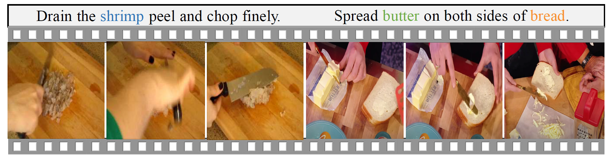

# WSVOG via Causal Intervention
## Introduction

This is the Pytorch implementation of our submitted paper.
<br/>

**The goal of WSVOG task is to ground objects described 
in the sentence to visual regions in the video, with only video-sentence annotations during training.**




## Requirements

* Python  3.7.9
* Pytorch  1.7.1
* cudatoolkit  11.0.3

To build all the dependencies, please run the instruction below:
```
conda install --yes --file requirements.txt
```


## Data Preparation


We use the 4096-dimensional features for YouCook2-BB which were provided in the CVPR 2019 paper: "Not All Frames Are Equal: Weakly-Supervised Video Grounding With Contextual Similarity and Visual Clustering Losses.“
You may follow the instructions in their [repo](https://github.com/jshi31/NAFAE) to extract region proposal features and their coordinates (rpn_box), and put them under the following directory:
```
./datasets/yc2_cvpr
```
For your convenience, we also provide our extracted region proposal features and coordinates on validation and testing sets [here](https://pan.baidu.com/s/1fcr7P8FpBOpNRy9gg8yPTw?pwd=gq8a) (31GB). Please download and unpack it using:
```
cat yc2_cvpr.tar.part* > yc2_cvpr.tar
tar -xvf yc2_cvpr.tar
```
then move them to `./datasets/yc2_cvpr`.

*For more details about YouCook2-BB dataset, please visit [here](http://youcook2.eecs.umich.edu/).*


## Evaluation

### Full Model
In order to evaluate our full model on both validation and testing sets, download and put the [pretrained model](https://drive.google.com/file/d/1Jd36UN9KP7mycoPnNGTKaMRAm43eEVE-/view?usp=sharing) under the directory `./checkpoint`, then run the following script:
```
python train.py --model_type full --train_test test --model_dir ./checkpoint/ModelBest.pkl
```

The expected performance of our method on the validation and testing sets of YouCook2-BB dataset is as follows.


<table>
<thead>
  <tr>
    <th rowspan="3">Methods</th>
    <th colspan="4">Query Accuracy (%)</th>
    <th colspan="4">Box Accuracy (%)</th>
  </tr>
  <tr>
    <th colspan="2">macro</th>
    <th colspan="2">micro</th>
    <th colspan="2">macro</th>
    <th colspan="2">micro</th>
  </tr>
  <tr>
    <th>val</th>
    <th>test</th>
    <th>val</th>
    <th>test</th>
    <th>val</th>
    <th>test</th>
    <th>val</th>
    <th>test</th>
  </tr>
</thead>
<tbody>
  <tr>
    <td>Full Model</td>
    <td>43.61</td>
    <td>45.03</td>
    <td>50.64</td>
    <td>51.00</td>
    <td>42.12</td>
    <td>43.22</td>
    <td>48.63</td>
    <td>48.97</td>
  </tr>
</tbody>
</table>


### STVG Baseline 
We also provide the pretrained STVG baseline model [here](https://drive.google.com/file/d/1JUoru4JbFRfkD-iERL6a9oJNqCWwBfeM/view?usp=sharing). To evaluate its performance,
download and put it under the directory `./Backbone`, then run the following script:
```
python train.py --model_type backbone --train_test test --model_dir ./Backbone/STVG_backbone.pkl 
```
The expected performance is as follows:

<table>
<thead>
  <tr>
    <th rowspan="3">Methods</th>
    <th colspan="4">Query Accuracy (%)</th>
    <th colspan="4">Box Accuracy (%)</th>
  </tr>
  <tr>
    <th colspan="2">macro</th>
    <th colspan="2">micro</th>
    <th colspan="2">macro</th>
    <th colspan="2">micro</th>
  </tr>
  <tr>
    <th>val</th>
    <th>test</th>
    <th>val</th>
    <th>test</th>
    <th>val</th>
    <th>test</th>
    <th>val</th>
    <th>test</th>
  </tr>
</thead>
<tbody>
  <tr>
    <td>STVG (baseline)</td>
    <td>41.43</td>
    <td>43.41</td>
    <td>48.72</td>
    <td>49.07</td>
    <td>39.98</td>
    <td>41.64</td>
    <td>46.77</td>
    <td>47.12</td>
  </tr>
</tbody>
</table>

<br/>

**Notice:** 
*Kindly note that compared with the baseline STVG, our model does not resort to any additional information.
Several recent methods boost the performance mainly by using powerful language models or external pose detectors, while 
our model outperforms all of them merely by pursuing the true causalities for WSVOG task.*


## Training

We provide scripts for the training of our model. To start with, just run the following script:
```
bash ./train_full_model.sh
```

## Acknowledgements
We really appreciate [YangXun](https://github.com/Xun-Yang) for the kind sharing of the source codes for STVG.
We also appreciate the original repositories from https://github.com/MichiganCOG/Video-Grounding-from-Text and https://github.com/jshi31/NAFAE. 
